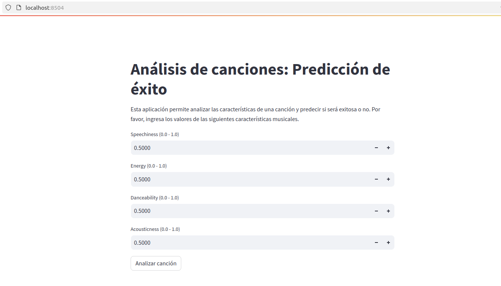
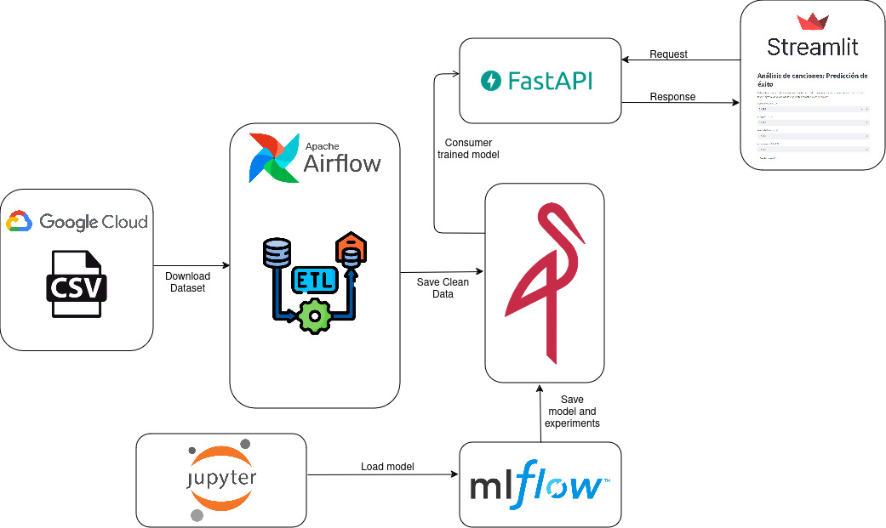
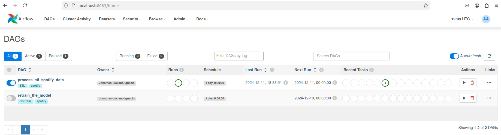
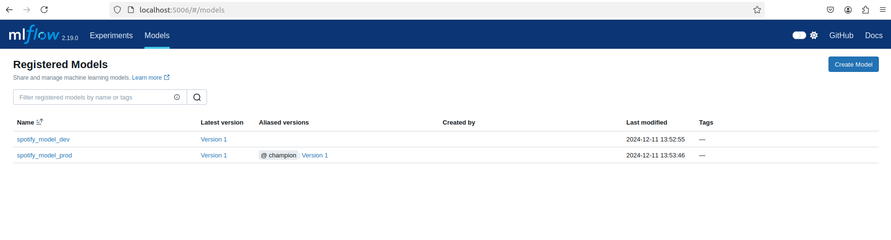
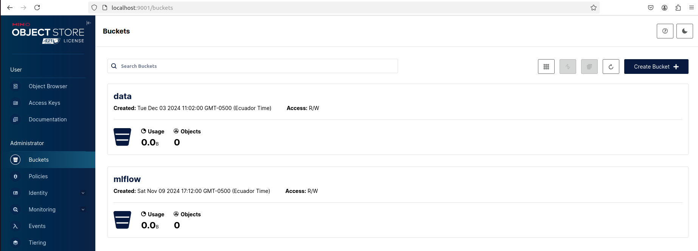
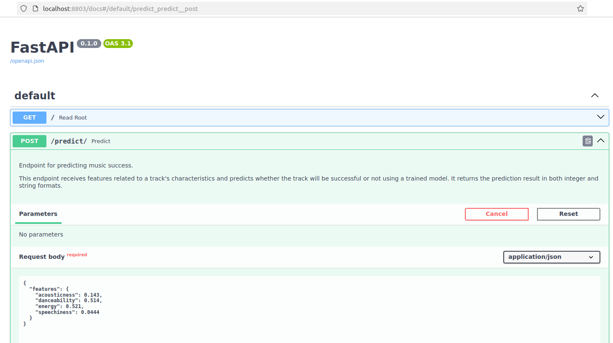

# Spotify Song Preference Prediction
### Project Team Members

- **Jonathan Cagua**  

- **Luciano Adassus**  

- **Ignacio de Pedro**  
## Objective

The Objective of this analysis is to predict whether a new song will appeal to the person actively using this playlist. To achieve this, various musical features of the songs are considered as input variables for the model:

1. Speechiness (0.0 - 1.0)  
   Indicates the presence of spoken elements in the track. A value closer to 1.0 suggests the track is predominantly spoken, while lower values correspond to more musical tracks.

2. Energy (0.0 - 1.0) 
   Represents the intensity and activity of the track. A high value indicates an energetic track, whereas a lower value corresponds to a more relaxed one.

3. Danceability (0.0 - 1.0)  
   Measures how suitable the track is for dancing, based on factors such as rhythm, stability, and regularity. A higher value indicates greater ease of dancing.

4. Acousticness (0.0 - 1.0)  
   Reflects the likelihood that the track is acoustic. A value closer to 1.0 indicates a high degree of acoustic elements, while lower values suggest greater use of electronic instruments or digital production.

These variables capture different dimensions of the songs, providing a solid foundation for evaluating and predicting their potential success within a specific playlist.



## Dataset Source

The dataset used in this analysis was sourced from Spotify's song collection. You can access the dataset from [this link](https://drive.google.com/file/d/13DDhnS2FoXN-xqWM9PWryQyUBgRTqcKg/view?usp=sharing).

---

## Project Components

This project involves the following key services and tools:

1. Airflow: Orchestrates the ETL pipeline for processing Spotify data.
2. MLflow: Tracks the machine learning experiments and registers datasets.
3. MinIO: Provides S3-compatible object storage for data and MLflow artifacts.
4. FastAPI: Exposes APIs for model inference and dataset management.
5. Streamlit: Offers a visualization and interaction interface for users.




---

## Local Setup Instructions

### Prerequisites

Ensure you have the following installed:
- Docker and Docker Compose
- Python 3.8+
- AWS CLI (for MinIO configuration if needed)

### Environment Variables

Use the following configuration in a `.env` file for Docker Compose:

```env
# Airflow Configuration
AIRFLOW_UID=50000
AIRFLOW_GID=0
AIRFLOW_PROJ_DIR=./airflow
AIRFLOW_PORT=8083
_AIRFLOW_WWW_USER_USERNAME=airflow
_AIRFLOW_WWW_USER_PASSWORD=airflow

# PostgreSQL Configuration
PG_USER=airflow
PG_PASSWORD=airflow
PG_DATABASE=airflow
PG_PORT=5444

# MLflow Configuration
MLFLOW_PORT=5006
MLFLOW_S3_ENDPOINT_URL=http://s3:9000

# MinIO Configuration
MINIO_ACCESS_KEY=minio
MINIO_SECRET_ACCESS_KEY=minio123
MINIO_PORT=9008
MINIO_PORT_UI=9009
MLFLOW_BUCKET_NAME=mlflow
DATA_REPO_BUCKET_NAME=data

# FastAPI Configuration
FASTAPI_PORT=8803

# Streamlit Configuration
STREAMLIT_PORT=8504
```

---

## Service Access Details

### 1. Airflow
   - Description: Manages and monitors the ETL pipeline.
   - URL: [http://localhost:8083](http://localhost:8083)
   - Credentials:  
     - Username: `airflow`  
     - Password: `airflow`

### 2. MLflow
   - Description: Tracks experiments and logs datasets.
   - URL: [http://localhost:5006](http://localhost:5006)

### 3. MinIO
   - Description: Provides object storage for datasets and artifacts.
   - Console URL: [http://localhost:9009](http://localhost:9009)
   - Credentials:
     - Access Key: `minio`
     - Secret Key: `minio123`

### 4. FastAPI
   - Description: Exposes API endpoints for predictions and dataset handling.
   - URL: [http://localhost:8803/docs#/](http://localhost:8803/docs#/)

### 5. Streamlit
   - Description: Interactive dashboard for exploring data and results.
   - URL: [http://localhost:8504](http://localhost:8504)

---

## Workflow Overview

### Steps in the ETL Pipeline:
1. Data Ingestion: 
   - Downloads the dataset from Google Drive.
   - Stores it in an S3 bucket using MinIO.
2. Feature Engineering:
   - Scales numerical features (`duration`, `tempo`, `loudness`) using `MinMaxScaler`.
   - Retains key features for modeling (`speechiness`, `energy`, `danceability`, `acousticness`).
   - Stores the processed dataset back into MinIO.
3. Dataset Splitting:
   - Splits the dataset into training and testing sets (70/30 split) using stratified sampling.
   - Saves the split datasets in S3.
4. Dataset Registration:
   - Logs dataset metadata and statistics (mean, standard deviation) to S3 and MLflow.

---

## Running the Project

### Step 1: Start the Services
Run the following command to start all services using Docker Compose:

```bash
docker compose --profile all up
```

### Step 2: Access Services
- Access Airflow



- Access MLflow 



- Access MinIO



- Access FastAPI



- Access Streamlit


### Step 3: Trigger the ETL DAG
- Login to the Airflow UI.
- Trigger the DAG named `process_etl_spotify_data`.

### Step 4: Monitor and Explore
- View logs and status in the Airflow UI.
- Check datasets and experiment tracking in MLflow.
- Use the FastAPI endpoints for model predictions.
- Explore the data and results using Streamlit.

